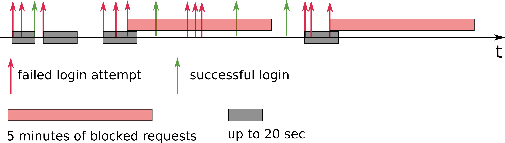

# Table of Contents
1. [Summary](README.md#summary)
2. [Details of Implementation](README.md#details-of-implementation)
3. [Download Data](README.md#download-data)
4. [Description of Data](README.md#description-of-data)

# Summary
Suppose we have a NASA fan website that generates a large amount of Internet traffic data. We will perform basic analytics on the server log file, provide useful metrics, and implement basic security measures. This dataset is inspired by real NASA web traffic, which is very similar to server logs from e-commerce and other sites. Monitoring web traffic and providing these analytics is a real business need.

## Details of Implementation

### Feature 1 
Lists in descending order the top 10 most active hosts/IP addresses that have accessed the site.

The output is written to a file, named `hosts.txt`. We list the 10 most active hosts/IP addresses in descending order and how many times they have accessed any part of the site.

e.g., `hosts.txt`:

    example.host.com,1000000
    another.example.net,800000
    31.41.59.26,600000
    …

### Feature 2 
Identifies the top 10 resources on the site that consume the most bandwidth. Bandwidth consumption can be extrapolated from bytes sent over the network and the frequency by which they were accessed.

The most bandwidth-intensive resources, sorted in descending order, is written to a file called `resources.txt`.

e.g., `resources.txt`:
    
    /images/USA-logosmall.gif
    /shuttle/resources/orbiters/discovery.html
    /shuttle/countdown/count.html
    …

### Feature 3 
Lists in descending order the site’s 10 busiest (i.e. most frequently visited) 60-minute period.

Written to a file named `hours.txt`, the start of each 60-minute window followed by the number of times the site was accessed during that time period. The file contains the start of each 60-minute window, followed by a comma and then the number of times the site was accessed during those 60 minutes. The 10 lines are listed in descending order with the busiest 60-minute window shown first. 

e.g., `hours.txt`:

    01/Jul/1995:00:00:01 -0400,100
    02/Jul/1995:13:00:00 -0400,22
    05/Jul/1995:09:05:02 -0400,10
    01/Jul/1995:12:30:05 -0400,8
    …

### Feature 4 
Detects patterns of three consecutive failed login attempts over 20 seconds in order to block all further attempts to reach the site from the same IP address for the next 5 minutes. Each attempt that would have been blocked is written to a file named `blocked.txt`.

After detecting three failed login attempts from the same IP address over a consecutive 20 seconds, we then write to the `blocked.txt` file any subsequent attempts to reach the site from the same IP address over the next 5 minutes. 

For example, if the third consecutive failed login attempt within a 20 second window occurred on `01/Aug/1995:00:00:08`, all access to the website for that IP address would be blocked for the next 5 minutes. Even if the same IP host attempted a login -- successful or or not -- one minute later at `01/Aug/1995:00:01:08`, that attempt should be ignored and logged to the `blocked.txt` file. Access to the site from that IP address would be allowed to resume at `01/Aug/1995:00:05:09`.

If an IP address has not reached three failed login attempts during the 20 second window, a login attempt that succeeds during that time period should reset the failed login counter and 20-second clock. 

For example, if after two failed login attempts, a third login attempt is successful, full access should be allowed to resume immediately afterward. The next failed login attempt would be counted as 1, and the 20-second timer would begin there. In other words, this feature should only be triggered if an IP has  3 failed logins in a row, within a 20-second window.

e.g., `blocked.txt`

    uplherc.upl.com - - [01/Aug/1995:00:00:07 -0400] "GET / HTTP/1.0" 304 0
    uplherc.upl.com - - [01/Aug/1995:00:00:08 -0400] "GET /images/ksclogo-medium.gif HTTP/1.0" 304 0
    …

The following illustration may help you understand how this feature might work, and when three failed login attempts would trigger 5 minutes of blocking:

## Download Data
The original data is too large to upload so I have instead included a smaller subset.

## Description of Data

Assume you receive as input, a file, `log.txt`, in ASCII format with one line per request, containing the following columns:

* **host** making the request. A hostname when possible, otherwise the Internet address if the name could not be looked up.

* **timestamp** in the format `[DD/MON/YYYY:HH:MM:SS -0400]`, where DD is the day of the month, MON is the abbreviated name of the month, YYYY is the year, HH:MM:SS is the time of day using a 24-hour clock. The timezone is -0400.

* **request** given in quotes.

* **HTTP reply code**

* **bytes** in the reply. Some lines in the log file will list `-` in the bytes field. For the purposes of this challenge, that should be interpreted as 0 bytes.

e.g., `log.txt`

    in24.inetnebr.com - - [01/Aug/1995:00:00:01 -0400] "GET /shuttle/missions/sts-68/news/sts-68-mcc-05.txt HTTP/1.0" 200 1839
    208.271.69.50 - - [01/Aug/1995:00:00:02 -400] “POST /login HTTP/1.0” 401 1420
    208.271.69.50 - - [01/Aug/1995:00:00:04 -400] “POST /login HTTP/1.0” 200 1420
    uplherc.upl.com - - [01/Aug/1995:00:00:07 -0400] "GET / HTTP/1.0" 304 0
    uplherc.upl.com - - [01/Aug/1995:00:00:08 -0400] "GET /images/ksclogo-medium.gif HTTP/1.0" 304 0
    ...
    
In the above example, the third line shows a failed login (HTTP reply code of 401) followed by a successful login (HTTP reply code of 200) two seconds later from the same IP address.
